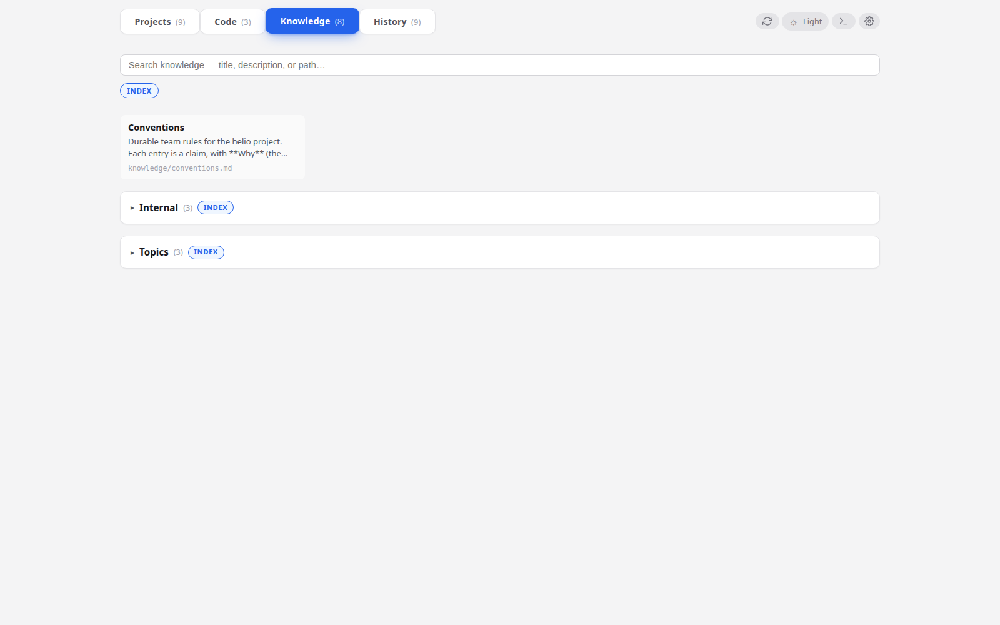

# The knowledge tree

**When to read this.** Your conception tree has grown, you keep writing the same note twice across items, and you want a place for durable reference material that outlives any one project.

`knowledge/` is a sibling of `projects/` under your conception root. condash walks it recursively and renders it as the **Knowledge** tab — a plain file explorer for durable docs that don't belong to any single item.

## What goes there

Unlike item notes (which belong to one project and age out of relevance when the project closes), `knowledge/` content is for material that stays useful across items:

- Team conventions, coding standards, decision records.
- Topic deep-dives written once and linked from many items.
- Per-app operational knowledge — how to run, deploy, debug.
- External reference material you want to keep offline with the rest of the tree.

If you find yourself copy-pasting the same explanatory paragraph into three different item notes, extract it to a knowledge file and wikilink into it instead (see [Link items with wikilinks](wikilinks.md)).

## Suggested layout

A shape that has held up in practice:

```
knowledge/
├── index.md                 # optional — overview / entry point
├── conventions.md           # team-wide rules, picked up from session
├── apps.md                  # short per-app descriptions
├── topics/
│   ├── index.md
│   ├── playwright-sandbox.md
│   └── pdf-pipeline.md
├── internal/
│   ├── index.md
│   └── helio.md             # per-app internal runbook
└── external/
    └── index.md
```

The three-folder split (`topics/`, `internal/`, `external/`) is not enforced by condash — it's a convention:

- **`topics/`** — cross-cutting technical reference.
- **`internal/`** — per-app operational knowledge that only makes sense to the team.
- **`external/`** — references copied in from outside (upstream docs, vendor runbooks).

Put `conventions.md` at the root because it's the first thing a new teammate opens.

## How condash scans the tree

On every render condash walks `knowledge/` recursively:

- Every `.md` file becomes a node.
- A file named `index.md` becomes the **index card** for its directory — its title and first paragraph are shown at the top of that level.
- Non-markdown files are skipped.
- Dot-files and dot-directories are skipped.
- Empty subtrees (no `.md` anywhere below) are pruned so the explorer doesn't render lone headings.

Titles come from the first `# Heading` line of the file. If the file has no top-level heading, the filename (minus extension, spaces for hyphens) is used.

## The Knowledge tab

Open the **Knowledge** tab in the header. The explorer shows the tree's top level as tiles, with subdirectories as collapsible folders:



Click a tile to open the file in the right-hand pane. Click a folder to expand it; the folder's `index.md` (if any) renders as a summary tile at the top.

The tab's header count is the total number of `.md` files across the tree. In the demo above: `Knowledge (8)` means eight files in total across the root, `internal/`, and `topics/`.

## Writing style

Two conventions that make the knowledge tab usable at scale:

- **Start every file with a one-sentence "what this is" line.** The search tab indexes README-like headers heavily, so a good first line surfaces the file from a keyword match.
- **Cross-link with wikilinks**, not absolute paths. `[[topics/pdf-pipeline]]` survives a rename of `knowledge/` (to e.g. `docs/`); a path like `../../knowledge/topics/pdf-pipeline.md` does not.

Use `index.md` files as signposts, not walls of prose. Two lines of "what's here, pick the right subtree" is worth more than a comprehensive TOC — the explorer already shows the TOC visually.

## Optional tree

If your conception root doesn't have a `knowledge/` directory, condash hides the tab entirely. There's no setup step to "enable knowledge mode" — the directory's presence is the signal.

To start: `mkdir -p <conception_path>/knowledge` and add a `conventions.md`. Refresh the dashboard. The tab appears.

## Search

Knowledge files are indexed by the **History** tab alongside items. A keyword match in a knowledge file surfaces as source `note` (same ranking weight as an item note). See [Search your history](search.md) for the ranking details.

## Next

- [Link items with wikilinks](wikilinks.md) — cross-link from an item's notes into `knowledge/` so the reference material is one click away.
- [Search your history](search.md) — find that convention you half-remember writing six months ago.
