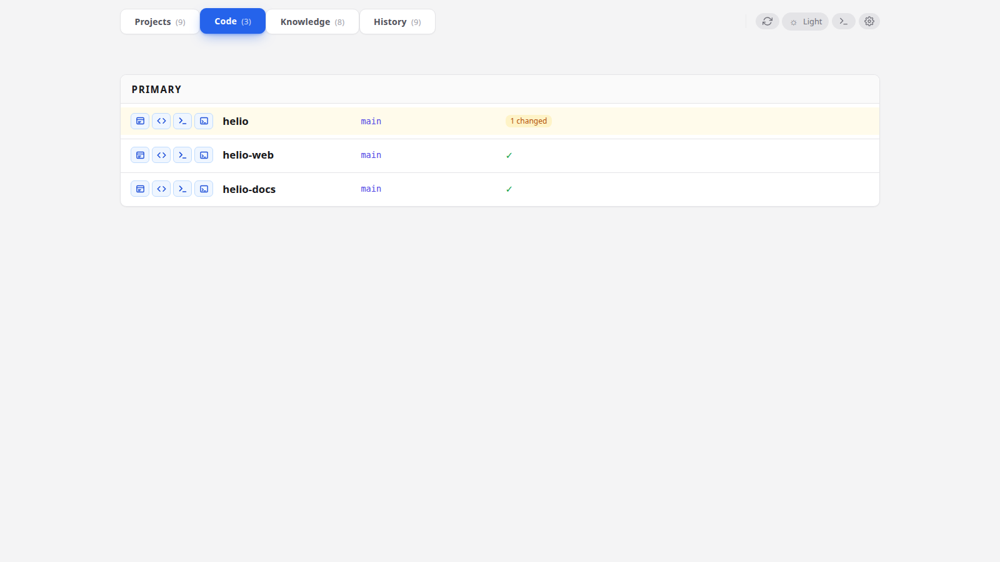

# Repositories and open-with buttons

**When to read this.** The **Code** tab shows the wrong repos, or the wrong repos are in the primary card, or the "open in IDE" button launches the wrong thing (or nothing).

Everything on this page lives in `<conception_path>/config/repositories.yml`. This file is versioned with the tree — changes propagate to every teammate who pulls. Per-machine overrides go in `preferences.yml` (see [Multi-machine setup](multi-machine.md)).

## Workspace and worktrees paths

```yaml
workspace_path: /home/you/src
worktrees_path: /home/you/src/worktrees
```

- **`workspace_path`** — the directory condash scans for git repositories. Every direct subdirectory that contains a `.git/` becomes a row in the Code tab.
- **`worktrees_path`** — an additional sandbox for the "open in IDE" launchers. Paths outside both roots are rejected before the shell sees the command.

If `workspace_path` is unset, the Code tab disappears.

## Grouping: primary, secondary, others

```yaml
repositories:
  primary:
    - helio
    - helio-web
  secondary:
    - helio-docs
```

Names are bare directory names (not paths) matched against whatever was found under `workspace_path`. Every repo not listed in either group lands in an auto-generated **OTHERS** card. The three cards render as a single strip, in the order primary → secondary → others:



The grouping is a UX signal, nothing more — every group behaves the same (same dirty counts, same launcher buttons). Use it to keep the repos you actually touch today at eye level.

## Submodules in a monorepo

If you work in a monorepo where different subdirectories are edited independently, use the submodule form:

```yaml
repositories:
  primary:
    - { name: helio, submodules: [apps/web, apps/api, crates/parser] }
```

Each listed subdirectory renders as a sub-row under the parent repo, keeps its own dirty count, and gets its own set of launcher buttons. The parent row stays collapsible.

This is an inline map (`{name: …, submodules: […]}`), not a nested block. A plain string entry continues to mean "treat the whole repo as one unit".

## The three `open_with` slots

Each repo row has three icon buttons: **main IDE**, **secondary IDE**, **terminal**. Wire them in `repositories.yml`:

```yaml
open_with:
  main_ide:
    label: Open in main IDE
    commands:
      - idea {path}
      - idea.sh {path}
  secondary_ide:
    label: Open in secondary IDE
    commands:
      - code {path}
      - codium {path}
  terminal:
    label: Open terminal here
    commands:
      - ghostty --working-directory={path}
      - gnome-terminal --working-directory {path}
```

- **`label`** — the tooltip text shown on hover.
- **`commands`** — a fallback chain. condash tries each entry in order until one starts successfully, then stops. The literal `{path}` is replaced with the absolute path of the repo (or submodule row) being opened.

The fallback chain is the key feature: on machine A where `idea` resolves, you get IntelliJ; on machine B where only `idea.sh` is on `$PATH`, the same config picks up the shell wrapper. No per-machine edits required.

Commands are parsed with `shlex`, so quoting works the way you'd expect: `"/Applications/JetBrains Toolbox/idea.app" {path}` is a single argv[0] + `{path}`.

Built-in defaults for the three slots reproduce the previous IntelliJ / VS Code / terminal behaviour, so a `repositories.yml` without any `open_with` section still gives functional buttons. Override only the slots you want to customise.

## Editing via the gear modal

Click the gear icon in the header, switch to the **Repositories** tab:


Form fields for `workspace_path`, `worktrees_path`, and the primary / secondary lists. Saves write `repositories.yml` atomically and reload the dashboard live. Add new repos to the primary list by dragging them up from the OTHERS card on the dashboard itself.

`open_with` is not currently exposed in the modal — edit `repositories.yml` directly for launcher changes.

## Sandbox rules

Every "open with" invocation validates its target path is under `workspace_path` or `worktrees_path`. Paths elsewhere are rejected. This is the single defence against a crafted URL parameter tricking condash into launching a command with an attacker-controlled argument — don't broaden the sandbox unless you know why.
