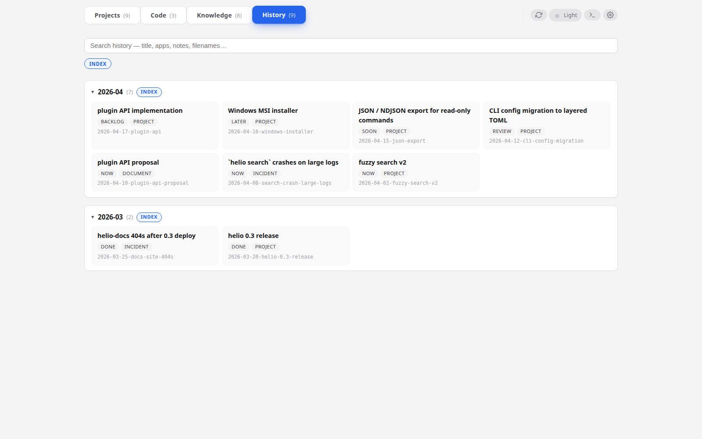

# Search your history

**When to read this.** You remember writing something — a note, a README paragraph, a step description — and you need to find it without grepping the tree by hand.

The **History** tab is a full-text search across every item's README, every note file, and every knowledge file. It re-indexes on every query; there's no background job and no stale cache.

## The tab

Click **History** in the top bar. A search box captures focus; start typing. Results render live as you type, ranked and grouped by item.

Each result has:

- The **item title and kind badge** — click to open that item's card.
- One or more **hit rows** underneath, each showing the source (readme / note / filename / title), the path or label, and a snippet with the matched token highlighted.

## What's indexed

For every item under `projects/*/*/`:

- The README title and slug.
- The `Apps` field value.
- The README body (everything below the header block).
- Every file under `notes/`.
- The filenames themselves (so you can find a note by its path even if the body doesn't match).

For every file under `knowledge/`:

- The first heading.
- The body.
- The path.

Content indexing covers `.md`, `.txt`, `.yml`, `.yaml`. Files larger than 512 KiB are skipped for content — filename and title still index. This keeps a stray large log or exported PDF text from dominating search cost.

## Ranking

Matches are weighted by where they're found:

| Source | Weight |
|---|---|
| Title / header field | 4 |
| Filename | 3 |
| README body | 2 |
| Note body | 2 |
| Other file | 1 |

A token found in the title contributes four times more to the score than the same token found deep in a note. Per-item scores sum across all hits. The final list is ordered by total score, with ties broken by most-recent-date-first.

## Token matching

The query is lower-cased and whitespace-split, preserving order. Duplicate tokens are dropped. Results must match **every** token (AND semantics) — there's no OR operator and no phrase-quoting.

All matches are substring matches. Token `fuzz` matches `fuzzy`, `fuzzing`, and `defuzz`; no stemming, no fuzzy matching, no synonyms.

Case is ignored.

## Snippets

Each hit row carries a snippet — the body text around the earliest token hit, with `<mark>` highlighting:

> …to index the **corpus** with the same format as the parser's real input.

Rules:

- Radius is 60 characters on either side of the hit.
- The snippet snaps to word boundaries (no mid-word cuts).
- Whitespace collapses to single spaces.
- Ellipses indicate truncation on either side.
- Every occurrence of every query token inside the snippet is marked, not just the anchor.

An empty snippet means the match was in a field without a rich body (e.g. the slug or a filename); the hit still shows, labelled by its source.

## Focus and keyboard flow

The search box takes focus automatically when you open the History tab. `Esc` clears the query; clicking an item opens its card (the tab switches to Projects); `Ctrl+L` style focus-grab is not wired — use the tab switch.

There are no keyboard shortcuts to move between results — click to open.

## Practical patterns

- **"Where did I write about X?"** — type `X`. Titles and filenames will surface first; body matches follow.
- **"What did I say about X in the Y project?"** — type `X Y`. Both tokens must match; results narrow to items that mention both.
- **"Find the note about the config migration"** — type `config migration`. If both words are in a filename (e.g. `notes/config-migration-decision.md`), filename weight (3) dominates the ranking.
- **"What's our convention for X?"** — knowledge files surface in the same ranking; a match in `knowledge/conventions.md` shows alongside item hits.

## What isn't searched

- Non-markdown binary files (images, PDFs, archives) — filename only.
- File content larger than 512 KiB.
- Everything under dot-directories (`.git/`, `.claude/`, etc.).
- `deliverables/` PDF **text** — the path is indexed, but condash doesn't extract PDF content.

If you need to search inside deliverable PDFs, grep them with an external tool or generate a searchable Markdown alongside the PDF (see [Deliverables and PDFs](deliverables.md)).
