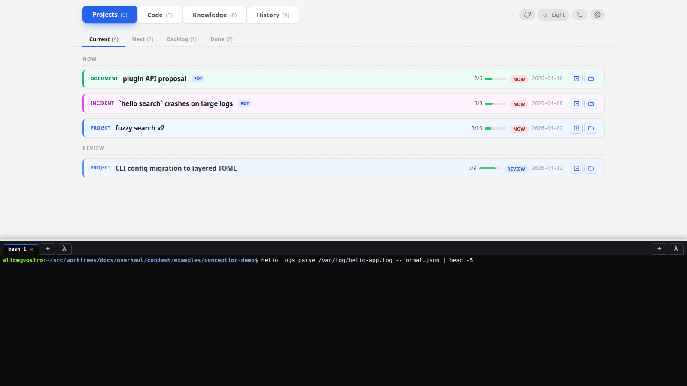
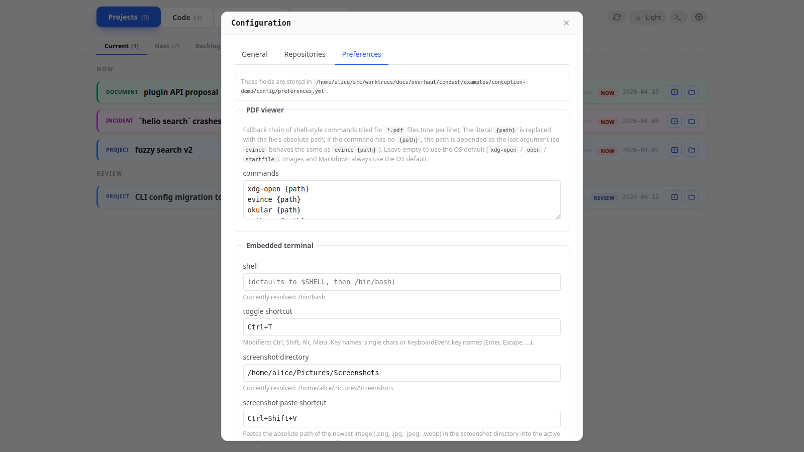

# Use the embedded terminal

**When to read this.** You want to stop alt-tabbing out to a separate terminal window while you work — or you tried the `>_` button in the header, opened the pane once, and couldn't find half the features.

The embedded terminal is a real PTY over a WebSocket. `bash` (or your configured shell) runs server-side; xterm.js (vendored under `/vendor/xterm/`, no CDN dependency) renders client-side.

## Opening the pane

Two ways:

- Click the `>_` icon in the dashboard header.
- Press the configured toggle shortcut. Default is `` Ctrl+` ``; change it under `terminal.shortcut` in `config.toml` or `preferences.yml`.



The pane pushes the dashboard up — it does not overlay. Toggling the pane closed suspends rendering but keeps every tab's PTY alive and its scrollback intact.

## Two sides, many tabs

The pane is split into a **left side** and a **right side**, each of which can host any number of tabs. Both sides are always visible when the pane is open (the split collapses automatically if a side is empty).

Each side has three buttons in its header:

- **`+`** — spawn a new tab running the configured shell.
- **Launcher `+`** (if `terminal.launcher_command` is set) — spawn a new tab whose child process is the launcher command instead of the shell. Default is `claude`, so this slot opens a Claude Code session. Set `launcher_command = ""` to hide the button.
- **Tab strip** — click to focus; middle-click to close.

Each tab is labelled with its child's argv[0] (e.g. `bash 1`, `claude 2`). The cwd starts at wherever condash was launched from; subsequent `cd` is your responsibility. `TERM=xterm-256color`, and the shell is launched with `-l` so your login rc-files run.

## Moving tabs between sides

Keyboard shortcuts move the active tab left or right:

| Action | Default shortcut | Config key |
|---|---|---|
| Move active tab to left side | `Ctrl+Left` | `terminal.move_tab_left_shortcut` |
| Move active tab to right side | `Ctrl+Right` | `terminal.move_tab_right_shortcut` |

The shortcut syntax follows the HTML `KeyboardEvent.key` convention: `Ctrl+Shift+X`, `Alt+1`, etc. Modifiers allowed: `Ctrl`, `Shift`, `Alt`, `Meta`.

Use this to pair a build terminal on one side with a log-tail on the other without leaving the keyboard.

## Screenshot-paste

This is the feature nobody discovers on their own. It solves one specific problem: "I just took a screenshot; now I want its path in my terminal to `cat`, `mv`, `gh pr comment --body-file`, or whatever."

Press `Ctrl+Shift+V` (configurable as `terminal.screenshot_paste_shortcut`) anywhere in the dashboard. condash:

1. Looks up `terminal.screenshot_dir` (default: `$XDG_PICTURES_DIR/Screenshots` on Linux, `~/Desktop` on macOS).
2. Finds the newest image file there.
3. Inserts its absolute path at the active tab's prompt — no `Enter` appended; you confirm.

Typical use: take a screenshot of a failing test → `Ctrl+Shift+V` → the path appears → prefix with `cat ` or drop into a `gh issue create --body-file ` command.

Clipboard-based paste (`Ctrl+V`) also works for regular text, and uses the OS clipboard via a server-side bridge (Qt) because xterm.js can't read the browser clipboard directly. Both `Ctrl+V` (paste) and `Ctrl+C` (copy) flow through this bridge.

## Configuration surface

Everything lives in `[terminal]` in `config.toml` or under `terminal:` in `preferences.yml`. The YAML copy overrides the TOML copy when both are set — so you can keep a machine-wide default in `~/.config/condash/config.toml` and per-tree overrides in the tree's `preferences.yml`.

```toml
[terminal]
shell                     = "/bin/zsh"
shortcut                  = "Ctrl+`"
screenshot_dir            = "/home/you/Pictures/Screenshots"
screenshot_paste_shortcut = "Ctrl+Shift+V"
launcher_command          = "claude"
move_tab_left_shortcut    = "Ctrl+Left"
move_tab_right_shortcut   = "Ctrl+Right"
```

See the [config reference](../reference/config.md) for the full key table with defaults.

## Editing shortcuts via the gear modal

The gear modal's **Preferences** tab has form fields for every `[terminal]` key:



Saves go to `preferences.yml`. The shortcut field shows a live "press the combination" capture when you click into it — less error-prone than hand-typing `KeyboardEvent.key` names.

## Platform note

The terminal is Linux and macOS only. On Windows the pane opens with a "terminal only supported on Linux/macOS" error message — PTY support through WSL is on the backlog, not shipped.
