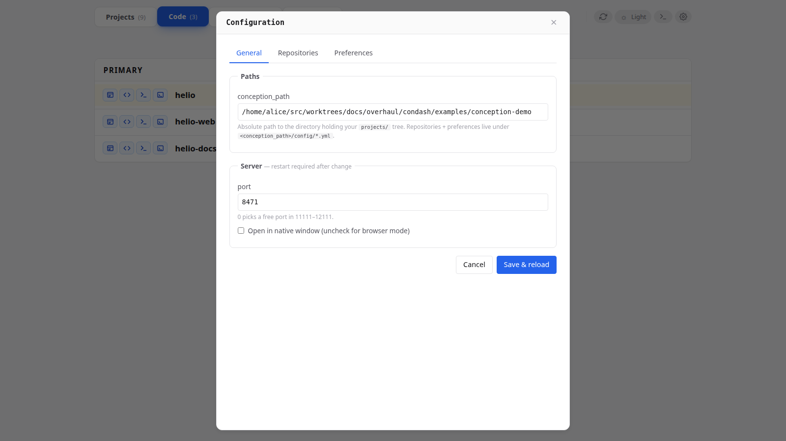
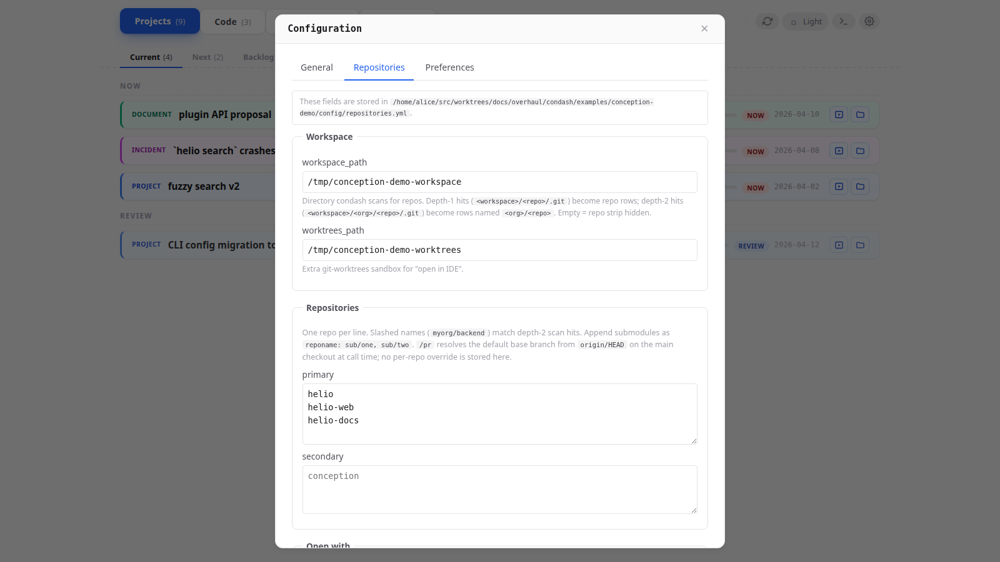

# Config files

## At a glance

condash reads **two** config files. Which file owns which key is not cosmetic — it's how per-machine and per-team boundaries are kept separate.

| File | Location | Scope | Owns |
|------|----------|-------|------|
| `config.toml` | `$XDG_CONFIG_HOME/condash/` (usually `~/.config/condash/`) | Per-machine, not shared | `conception_path`, `port`, `native`, `pdf_viewer`, `terminal` |
| `repositories.yml` | `<conception_path>/config/repositories.yml` | Per-tree, versioned in git | `workspace_path`, `worktrees_path`, `repositories`, `open_with` |
| `preferences.yml` | `<conception_path>/config/preferences.yml` | Per-tree but **not** versioned — per-machine preferences for this tree | `pdf_viewer`, `terminal` |

The two YAML files live *inside* the conception tree itself. On any given machine, the three files are merged at load time: YAML values override the TOML defaults, so moving a team-wide setting into `repositories.yml` automatically propagates to every developer who pulls the tree.

## `config.toml` (per-machine)

Default location: `$XDG_CONFIG_HOME/condash/config.toml`, falling back to `~/.config/condash/config.toml`.

```toml
conception_path = "/path/to/conception"
port            = 0
native          = true
pdf_viewer      = ["evince {path}", "okular {path}"]

[terminal]
shell                     = "/bin/zsh"
shortcut                  = "Ctrl+`"
screenshot_dir            = "/home/you/Pictures/Screenshots"
screenshot_paste_shortcut = "Ctrl+Shift+V"
launcher_command          = "claude"
move_tab_left_shortcut    = "Ctrl+Left"
move_tab_right_shortcut   = "Ctrl+Right"
```

| Key | Required | Meaning |
|-----|----------|---------|
| `conception_path` | **yes** | Absolute path to the root of the conception tree condash renders. Must contain `projects/` (and may contain `knowledge/` and `config/`). |
| `port` | no | TCP port for the embedded HTTP server. `0` (default) means "pick a free port in `11111–12111`". Set a fixed value if you want `http://127.0.0.1:<port>` to be stable. |
| `native` | no | `true` (default) opens a desktop window via `pywebview`. `false` skips pywebview and serves the dashboard in whatever browser points at `http://127.0.0.1:<port>` — useful when the Qt/GTK backend isn't available. |
| `pdf_viewer` | no | Bare list of shell-style commands, tried in order. `{path}` is replaced with the absolute path of the PDF. Unset or empty → falls back to the OS default. **Note**: it's a top-level list, **not** `pdf_viewer.commands = [...]`. |
| `[terminal]` | no | Embedded terminal settings — see below. |

### `[terminal]`

| Key | Default | Meaning |
|-----|---------|---------|
| `shell` | `$SHELL` → `/bin/bash` | Absolute path to an interactive shell. |
| `shortcut` | `` Ctrl+` `` | Toggle the terminal pane. Modifiers: `Ctrl`, `Shift`, `Alt`, `Meta`. Key names follow the HTML `KeyboardEvent.key` convention. |
| `screenshot_dir` | `$XDG_PICTURES_DIR/Screenshots`, else `~/Pictures/Screenshots` on Linux, `~/Desktop` on macOS | Directory scanned for "most recent screenshot" by the paste shortcut. |
| `screenshot_paste_shortcut` | `Ctrl+Shift+V` | Inserts the absolute path of the newest image in `screenshot_dir` into the active terminal. No `Enter` — user confirms. |
| `launcher_command` | `claude` | Shell-style command spawned by the secondary `+` button in each terminal side. Empty hides the button. |
| `move_tab_left_shortcut` | `Ctrl+Left` | Move the active tab to the left pane. |
| `move_tab_right_shortcut` | `Ctrl+Right` | Move the active tab to the right pane. |

## `repositories.yml` (per-tree, versioned)

Lives at `<conception_path>/config/repositories.yml`. Commit it — every developer who pulls the tree gets the same workspace layout and "open with" commands.

```yaml
workspace_path: /home/you/src
worktrees_path: /home/you/src/worktrees

repositories:
  primary:
    - condash
    - { name: helio, submodules: [apps/web, apps/api] }
  secondary:
    - conception

open_with:
  main_ide:
    label: Open in main IDE
    commands:
      - idea {path}
      - idea.sh {path}
  secondary_ide:
    label: Open in secondary IDE
    commands:
      - code {path}
      - codium {path}
  terminal:
    label: Open terminal here
    commands:
      - ghostty --working-directory={path}
      - gnome-terminal --working-directory {path}
```

| Key | Meaning |
|-----|---------|
| `workspace_path` | Directory condash scans for git repositories. Every direct subdirectory containing a `.git/` shows up in the **Code** tab. If unset, the tab is hidden. |
| `worktrees_path` | Additional sandbox for the "open in IDE" buttons. Paths outside `workspace_path` and `worktrees_path` are rejected before the shell sees them. |
| `repositories.primary` | List of bare directory names (not paths) matched against the scan. Shown in the `PRIMARY` card. |
| `repositories.secondary` | Same as primary, shown in the `SECONDARY` card. Anything under `workspace_path` not named in either list lands in an `OTHERS` card. |
| Entry with `submodules` | An inline map `{name: repo, submodules: [sub/one, sub/two]}` renders the repo as an expandable row with sub-rows for each listed subdirectory. Each submodule keeps its own dirty count and "open with" buttons. Useful for monorepos where different subtrees are edited independently. |
| `open_with.<slot>` | Three vendor-neutral launcher slots (`main_ide`, `secondary_ide`, `terminal`). Each slot has a `label` (tooltip) and a `commands` fallback chain. |

### `{path}` substitution

Each `commands` entry is a single shell-style string parsed with `shlex`. The literal `{path}` is replaced with the absolute path of the repo / worktree being opened. Commands are tried in order until one starts successfully — if `idea {path}` isn't on `$PATH`, the button falls through to `idea.sh {path}` automatically.

Built-in defaults reproduce the previous IntelliJ / VS Code / terminal behaviour, so a `repositories.yml` with no `open_with` section still gives functional buttons. Override only the slots you want to customise.

## `preferences.yml` (per-tree, **not** versioned)

Lives at `<conception_path>/config/preferences.yml`. **Do not** commit this file — add it to the tree's `.gitignore`. It holds the same per-machine keys as the TOML file, but scoped to the tree, so different trees on the same machine can use different terminal shortcuts or PDF viewers.

```yaml
pdf_viewer:
  - xdg-open {path}
  - evince {path}

terminal:
  shortcut: Ctrl+T
  screenshot_paste_shortcut: Ctrl+Shift+V
  launcher_command: claude
```

Keys match the `config.toml` schema exactly. `preferences.yml` **overrides** `config.toml` when both set the same key for the current tree.

## Merge order

At load time:

1. Start with defaults.
2. Merge `~/.config/condash/config.toml` on top.
3. Merge `<conception_path>/config/repositories.yml` on top (adds `workspace_path`, `worktrees_path`, `repositories`, `open_with`; these keys don't appear in the TOML file).
4. Merge `<conception_path>/config/preferences.yml` on top.

Result: you get sensible per-machine defaults from `~/.config/`, team-shared repo/IDE settings from the versioned YAML, and optional per-tree per-machine tweaks from the untracked YAML.

## Editing from the dashboard

Click the gear icon in the header. A modal opens with three tabs:



- **General** → writes `conception_path`, `port`, `native` to `config.toml`.
- **Repositories** → writes `workspace_path`, `worktrees_path`, `repositories`, `open_with` to `repositories.yml`.
- **Preferences** → writes `pdf_viewer`, `terminal` to `preferences.yml`.




Saves are atomic (`tomlkit` / PyYAML) and preserve comments you've added outside the header block. Changes to `port` and `native` require a restart; the modal tells you so. Everything else reloads live.
