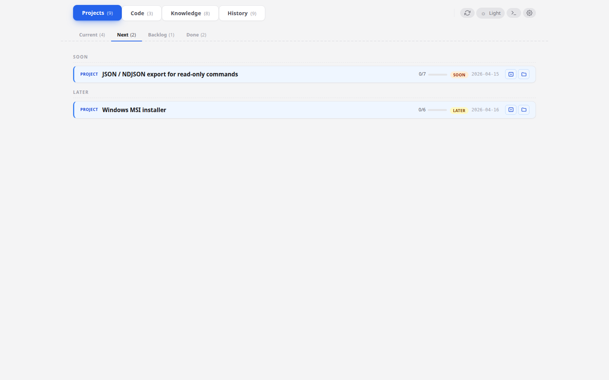

# Your first project

**When to read this.** You finished [First run](first-run.md) and have condash running against the `conception-demo` tree. Now you want to do actual work in it — create an item, change its status, add and close steps, drop a note, cross-link items.

By the end, you'll have added a new project to the tree, walked it from `soon` through `now` to `done`, and understood which actions live in the dashboard versus which live in your editor.

## The two kinds of action

Before we start: condash's **write surface is deliberately small**. The dashboard mutates files only for a handful of actions (toggling a step, changing status, editing the config). Everything else — creating a new item, writing the body of a README, editing a note — happens in your editor. You can absolutely also create items from a Claude Code session via the [management skill](../reference/skill.md), but it's the same thing: the skill just writes the files, and the dashboard re-renders.

See the full list in [Mutation model](../reference/mutations.md).

## 1. Create the item

Projects live at `projects/YYYY-MM/YYYY-MM-DD-slug/README.md`. Pick today's date and a slug. From a shell:

```bash
mkdir -p ~/conception-demo/projects/2026-04/2026-04-18-helio-benchmark-harness/notes
cat > ~/conception-demo/projects/2026-04/2026-04-18-helio-benchmark-harness/README.md <<'EOF'
# Helio benchmark harness

**Date**: 2026-04-18
**Kind**: project
**Status**: soon
**Apps**: `helio`

## Goal

Build a repeatable benchmark harness for the helio parser so we can catch
perf regressions before release instead of during them.

## Scope

**In scope**

- Seed corpus at 3 fixed sizes (1 MiB / 100 MiB / 1 GiB), checked into a
  `fakelog` submodule.
- `make bench` target that runs the full matrix and emits a JSON report.
- Comparison against the previous run's baseline — fail CI if p95 regresses
  by more than 10%.

**Out of scope**

- A dashboard for historical trends. JSON is the interchange; visualisation
  comes later.

## Steps

- [ ] Pick a corpus storage format (fakelog submodule vs asset in releases).
- [ ] Wire `make bench` to drive the existing `cli.py::bench` subcommand.
- [ ] Capture p50 / p95 / p99 and total runtime per size.
- [ ] Add the regression check to `.github/workflows/ci.yml`.
- [ ] Document the harness in [[fuzzy-search-v2|the fuzzy-search item]] so
      that item's benchmarking notes stop living in a standalone file.

## Timeline

- 2026-04-18 — Project created.

## Notes
EOF
```

Switch back to the condash window and click the refresh icon in the header. The project appears under **Next** with status `soon`.



Notice the `[[fuzzy-search-v2|the fuzzy-search item]]` in the last step — that's a **wikilink** that will resolve to the existing fuzzy-search-v2 item. Click the step text once you've expanded the card; condash follows the link to that item's card.

## 2. Change its status from the dashboard

Click into the project card to expand it. Somewhere in the header you'll see a status pill that currently reads **SOON**. Click-and-drag the whole item row to the **Current** sub-tab, or use the gear dropdown on the card. The dashboard rewrites the `**Status**:` line in the README.

Check with `git diff` in a second shell:

```bash
cd ~/conception-demo
git diff projects/2026-04/2026-04-18-helio-benchmark-harness/README.md
```

You'll see exactly one line changed: `-**Status**: soon` → `+**Status**: now`. That's the entire mutation.

## 3. Toggle a step

With the card still expanded, tick the checkbox on the first step ("Pick a corpus storage format"). The marker flips from `[ ]` to `[x]`; the progress counter on the card header jumps from `0/5` to `1/5`.

Tick another — try the second one — and then **shift-click** a third to mark it in-progress (`[~]`). Three states are now visible side by side:

- two `[x]` (done, struck through)
- one `[~]` (in progress, filled amber)
- two `[ ]` (open)

`git diff` shows three single-line edits; the rest of the file is untouched.

## 4. Add a note

The dashboard can create files inside `<item>/notes/`. Click the **`+`** button in the Files panel (bottom-left of the expanded card). Name the new file `corpus-format.md` and hit Enter.

A blank preview opens on the right. Click into it to edit; condash writes as you type. Paste something plausible:

```markdown
# Corpus format decision

Two options:

1. **Git submodule** (`fakelog`) pinned to a content-addressed tag. Pro: one
   tree stays reproducible across machines. Con: 1 GiB corpus makes cloning
   expensive on fresh setups.
2. **Release asset** fetched on first run via a cached script. Pro: clone
   stays small. Con: another thing that can 404.

Going with (1) — the reproducibility cost of (2) is too high for a perf harness.
```

Click back to the README pane. The note you just created shows up in the Files tree. That's it — the note is a regular `.md` file under `<item>/notes/`, gitignorable, diffable, editable from your editor too.

## 5. Cross-link with a wikilink

You already have a wikilink from your item *into* fuzzy-search-v2. Go the other way: open `projects/2026-04/2026-04-02-fuzzy-search-v2/notes/design.md` in your editor and add a line:

```markdown
> See also: [[helio-benchmark-harness]] — the shared harness we're extracting
> the parser benchmarks into.
```

Refresh the dashboard. Click fuzzy-search-v2 → open `design.md` in the note pane → click the new wikilink. Condash navigates straight to your item. The whole resolution is [[slug]]; no URLs, no IDs.

More on link shapes in [Link items with wikilinks](../guides/wikilinks.md).

## 6. Close the project

Tick the remaining steps (we won't actually do any of the work — this is a tutorial). When the step counter reads `5/5`, drag the item to the **Done** sub-tab or change status via the card's status dropdown. `**Status**: now` becomes `**Status**: done`.

## 7. Done items stay where they were created

The project is now at `projects/2026-04/2026-04-18-helio-benchmark-harness/` with `**Status**: done`. It doesn't move. Under the flat-month layout condash expects, items live under their creation month for their whole lifecycle — status alone signals done-ness. Look at the two items in `projects/2026-03/` in the demo tree: those are last month's done items, and they stayed right where they were created.

The **Done** sub-tab in the dashboard groups closed items so they're out of the way without being out of sight.

## What you just learned

- Items are filesystem directories with a `README.md` and optional `notes/`. Create them in your editor (or via the management skill) — the dashboard doesn't create items, only mutates them.
- The dashboard's mutations are narrow: toggle step, edit step, change status, create/rename/upload notes, save config. Everything else is yours to do in an editor. See [Mutation model](../reference/mutations.md).
- Wikilinks (`[[slug]]`) cross-link items. They resolve to any item whose directory name ends in `-<slug>`.
- Items never move. An item lives under its creation-month directory forever; `**Status**: done` alone signals closure.

## Next

**[A day with condash →](daily-loop.md)** — the realistic workflow: open code from the repo strip, use the embedded terminal to run a build, paste a screenshot into a note, create a PR, close.
