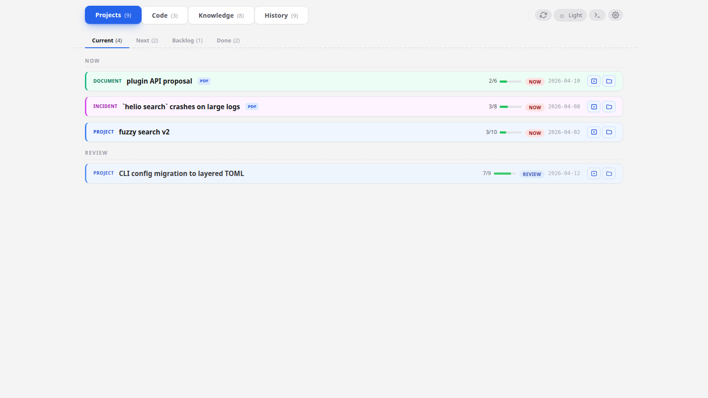

# First run

**When to read this.** You've never used condash. You want to get to a working dashboard on your machine in one sitting, with a tree of realistic items to poke at before you commit to building your own.

By the end, you'll have condash installed, running against the bundled `conception-demo` tree, and the `Projects`, `Code`, `Knowledge`, and `History` tabs will all render with content.

## 1. Install condash

```bash
pipx install condash
# or: uv tool install condash
```

Both install `condash` into its own isolated venv and put it on your `$PATH`. The install is self-contained on Linux, macOS, and Windows — the native-window backend (`pywebview[qt]` → `PyQt6` + `PyQt6-WebEngine`) is a normal Python dependency, so there's no system-level Qt or GTK step. Install size is about 100 MB.

Verify:

```bash
condash --version
```

If you see `command not found`, run `pipx ensurepath` and reopen the shell.

## 2. Fetch the demo tree

The condash repo ships a realistic demo tree at [`examples/conception-demo/`](https://github.com/vcoeur/condash/tree/main/examples/conception-demo). It has nine items, all six statuses, a knowledge tree, and two deliverable PDFs — enough for every feature in the rest of the tutorials to have something to act on.

Copy it into a working location:

```bash
mkdir -p ~/conception-demo
curl -fsSL https://codeload.github.com/vcoeur/condash/tar.gz/main \
  | tar -xz --strip-components=2 -C ~/conception-demo \
      condash-main/examples/conception-demo
```

Inspect what you got:

```
~/conception-demo/
├── README.md
├── config/
│   ├── preferences.yml
│   └── repositories.yml
├── projects/
│   ├── 2026-03/         # items created last month (2 done)
│   └── 2026-04/         # 7 items created this month (3 now, 1 review, 1 soon, 1 later, 1 backlog)
└── knowledge/
    ├── conventions.md
    ├── internal/
    └── topics/
```

Everything is plain Markdown. Open `projects/2026-04/2026-04-02-fuzzy-search-v2/README.md` in your editor to see the header format.

## 3. Point condash at the tree

```bash
condash init
```

This writes a commented template to `~/.config/condash/config.toml`. Edit it and set a single line:

```toml
conception_path = "/home/you/conception-demo"
```

Everything else in the template can stay commented out — we'll fill those in later.

## 4. Launch

```bash
condash
```

A desktop window opens. You should see this:



The header shows four top-level tabs with counts: **Projects (9)**, **Code (3)**, **Knowledge (8)**, **History (9)**. Under **Projects**, the sub-tabs are **Current / Next / Backlog / Done**. The demo tree was built so every bucket has something in it.

## 5. Walk around

Take two minutes to click through:

- **Current** — 3 items with status `now` (one of each kind: document, incident, project) and 1 item with status `review`. Click the fuzzy-search-v2 row; the card expands, showing the README on the left and a step list on the right with all four marker states (`[x]`, `[~]`, `[ ]`, `[-]`).
- **Next** — the soon bucket. One project (`json-export`).
- **Backlog** — one project, parked.
- **Done** — two archived items from the previous month.
- **Code** — three repos: condash scanned `workspace_path: /tmp/conception-demo-workspace` from `config/repositories.yml` and found one `.git/` per entry. (If the Code tab shows 0, the workspace path on your machine doesn't exist yet — we'll set that up properly in [Your first project](first-project.md).)
- **Knowledge** — the `knowledge/` tree rendered as an explorer: `conventions.md` at the root, `Internal` and `Topics` folders with index files.
- **History** — full-text search across every item + note. Type `fuzzy` to see ranked matches.

Click the gear icon in the top right to see the **Configuration** modal with three tabs — General / Repositories / Preferences. Everything there maps to keys in either `~/.config/condash/config.toml` (machine-local) or `conception-demo/config/*.yml` (tree-versioned). You'll use this modal in the next tutorial.

## 6. Close the window

Closing the native window exits condash. Relaunch with `condash` whenever you want to come back — state lives in the files, not in the app.

## What you just learned

- Installing condash is a single `pipx`/`uv` command; no system prerequisites.
- `condash init` + `condash config edit` is the setup flow; the only mandatory field is `conception_path`.
- The dashboard renders the files as-is on every page load. There's no database, no watcher, no cache.
- The tree has two config files — one per-machine (TOML), one versioned with the tree (YAML). We'll dig into that split in [Configure the conception path](../guides/configure-conception-path.md).

## Next

**[Your first project →](first-project.md)** — create a real item, wire its steps, link it to another item, add a note.
